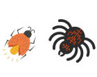

# Write yourself a crawl spider---Python#

> ### *[crawl spider](http://www.baike.com/wiki/%E7%BD%91%E7%BB%9C%E7%88%AC%E8%99%AB)* Web crawler (also known as web spider, web robot. In the middle of the FOAF community, more often known as web chaser) is a program or script,which according to certain rules and automatically crawl the web.

###Do it youself###

---
###The crawler frame consists of 5 parts:

- Controller
- UrlManager
- HTMLDownloader
- HTMLParser
- Outputer

### Controller
	Control the start and end of crawler

### UrlManager
	def __init__(self):
        self.new_urls = set()
        self.old_urls = set() 

### HTMLDownloader
	Download HTML page

### HTMLParser 
	def parse(self,page_url,html_cont):
        if page_url is None or html_cont is None:
            return
        soup = BeautifulSoup(html_cont,'html.parser',from_encoding=r'utf-8')
        new_urls = self._get_new_urls(page_url,soup)
        new_data = self._get_new_data(page_url,soup)
        return new_urls,new_data

### Outputer
	Obtained the desired data,put it into 'output.html' file.

